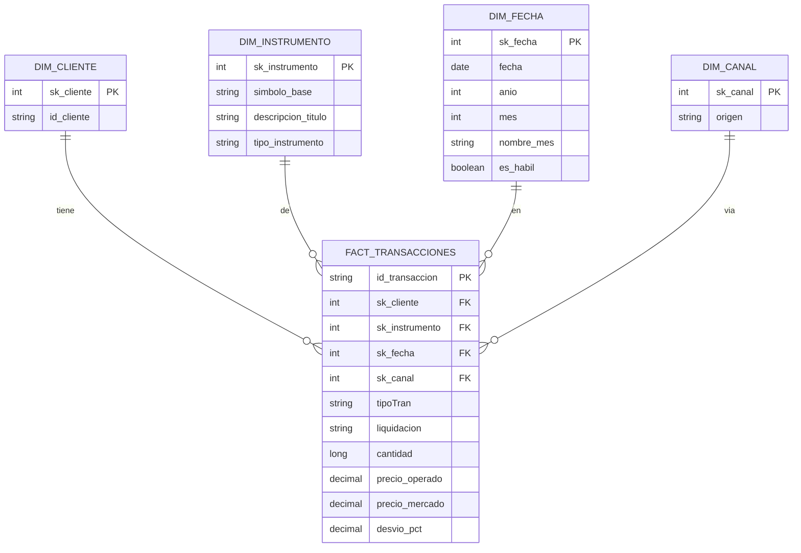

# iol-challenge-data-engineer

# Pipeline de operaciones bursátiles BYMA

## Arquitectura

```
CSV origen
    │
    ▼
┌─────────────────────────┐
│  BRONZE                 │
│  Ingesta batch por día  │
└───────────┬─────────────┘
            │
            ▼
┌─────────────────────────┐
│  SILVER                 │
│  Limpieza, tipado, mapeo│
└───────────┬─────────────┘
            │
            ▼
┌─────────────────────────┐        ┌──────────────────────────┐
│  GOLD                   │◄───────┤  API cotizaciones         │
│  Modelo dimensional     │        │  Enriquecimiento externo  │
└───────────┬─────────────┘        └──────────────────────────┘
            │
            ▼
┌─────────────────────────┐
│  Análisis y consultas   │
│  SQL sobre capa gold    │
└─────────────────────────┘
```

Cada capa se materializa como tabla Delta Lake; el orden de ejecución se simula con `dbutils.notebook.run()` entre notebooks (restricción de Community/Free Edition: sin Jobs, sin DLT).

## Justificación del modelo de datos

Esquema medallón (Bronze / Silver / Gold) elegido porque:
- Permite dejar trazabilidad completa del dato crudo sin transformar (requerimiento de negocio en el sector financiero)
- Separa responsabilidades por capa: ingesta sin pérdida de información → limpieza y tipado → modelo listo para consumo analítico

## Transformaciones por capa

**Bronze**: ingesta del CSV sin transformar, simulando batch particionado por día (columna derivada `fecha_particion`). Se agregan columnas de auditoría de calidad — cada registro se marca (no se descarta) según las anomalías detectadas: operación en día inhábil (fin de semana), cantidad en rango extremo (por encima del percentil 99.9 del propio dataset).

**Silver**: tipado correcto de columnas (fechas, decimales), resolución de variantes de liquidación de símbolo (ej. `AL30` vs `AL30D`: mismo instrumento base, distinta moneda de liquidación — se separan en `simbolo_base` y `liquidacion`). Solo pasan a Silver los registros sin anomalías marcadas en Bronze; los marcados quedan documentados en Bronze como fuente de trazabilidad, no se replican en capas posteriores.

**Gold**: modelo dimensional orientado al análisis de comportamiento de clientes — dimensiones (`dim_cliente`, `dim_instrumento`, `dim_fecha`, `dim_canal`) con surrogate keys, y `fact_transacciones` a grano de una transacción individual, enriquecida con el precio de mercado de la API externa al momento de la operación. Ver detalle completo del modelo más abajo.

## Decisiones técnicas

**Formato de almacenamiento**: Delta Lake en todas las capas (obligatorio por consigna) — da ACID, versionado, y compatibilidad nativa con Spark.

**Particionamiento**: por `fecha_particion` en Bronze, Silver y en la tabla de hechos de Gold, dado el volumen (~100k filas crudas en 3 meses, ~1.100 operaciones/día) — mantiene lecturas incrementales eficientes sin generar exceso de archivos pequeños.

**Idempotencia**: Bronze y Silver escriben por partición de día (`replaceWhere`), de forma que reprocesar el mismo día no duplica registros. Se usa `replaceWhere` en vez de `MERGE` por clave porque las transacciones son eventos que no se modifican una vez cargados. Las dimensiones de Gold (tablas chicas) se recargan completas con `overwrite` simple en cada corrida, sin necesidad de partición.

**Orquestación**: sin Jobs pagos disponibles en esta edición, se simula con notebooks encadenadas vía `dbutils.notebook.run()` — el mismo concepto de orquestación que uso hoy con Data Factory en producción, adaptado a la restricción del entorno.

**Entorno**: Databricks Free Edition con compute Serverless — sin control de sizing de cluster ni políticas de gobernanza; en un entorno productivo esas configuraciones se ajustarían al volumen real de datos.

**Ubicación de tablas**: se usaron tablas managed de Unity Catalog en vez de external location, dado que el challenge no especifica una ubicación de storage externa y las tablas managed simplifican la gestión en el contexto de Free Edition.

**Robustez del pipeline de enriquecimiento**: la respuesta de la API de cotizaciones no siempre trae el mismo formato — algunos símbolos no existen en la fuente y devuelven una estructura distinta a la esperada. El código detecta esto verificando que las columnas necesarias estén presentes antes de usarlas; si no lo están, el símbolo se registra como error y el proceso continúa con el resto, en vez de interrumpirse. Además, se agregó una verificación de conteo (`assert`) después de enriquecer `fact_transacciones`, que compara el total de filas contra el original antes de guardar — así cualquier problema de duplicación en el join se detecta antes de escribir datos incorrectos, en vez de después.

## Modelo dimensional (capa Gold)

### Diagrama



### Granularidad

Cada fila de `fact_transacciones` es **una transacción**. No hay resúmenes ni promedios en esta tabla — cada operación de compra o venta queda registrada tal cual pasó.

### Cómo se armó cada dimensión

**dim_cliente**: se mantiene la dimensión solo con atributos propios del cliente, evitando campos como cuántas operaciones hizo, para conservar la estabilidad de la dimensión.

**dim_instrumento**: un instrumento por fila (símbolo ya limpio, sin el sufijo de moneda), con el campo `tipo_instrumento` que dice si es bono, acción local o CEDEAR. Se construye agrupando por `simbolo_base` y quedándose con una sola descripción por símbolo — inicialmente se armó con `distinct()` sobre símbolo y descripción juntos, lo que generaba más de una fila por símbolo cuando la descripción venía con variantes menores, y eso multiplicaba filas al cruzar con la tabla de hechos. Se corrigió agrupando explícitamente por `simbolo_base`.

**dim_fecha**: una fecha por fila, con año, mes y si es día hábil o no. Sirve para agrupar y comparar por mes.

**dim_canal**: un canal por fila (App Mobile, Web, API, etc.).

### Cómo se decidió el tipo de instrumento

El dataset no tiene una columna que diga si algo es bono, acción o CEDEAR — hay que deducirlo mirando el símbolo. Se usó esta regla simple:

1. Si el símbolo tiene 2 letras seguidas de 2 números (por ejemplo `AL30`) → **bono soberano**
2. Si el símbolo está en una lista de empresas argentinas conocidas (por ejemplo `YPFD`, `GGAL`) → **acción local**
3. Si no cae en ninguna de las dos anteriores → **CEDEAR**

### Segmentación de clientes

En vez de guardar la segmentación (Alta/Media/Baja actividad) como un campo fijo en `dim_cliente` — que la haría cambiar todo el tiempo, algo que no debería pasar en una dimensión — se calcula con una consulta SQL sobre `fact_transacciones` cuando se necesita, contando cuántas operaciones hizo cada cliente en el período.

### precio_mercado y desvio_pct

Estas dos columnas se completan en el paso de enriquecimiento con la API de cotizaciones (Task 4).

## Fuente de cotizaciones

Se usó [data912](https://data912.apidocs.ar/), una API pública y gratuita (no oficial, de uso educativo) que cubre con endpoints dedicados las tres categorías del dataset: acciones argentinas (`/historical/stocks/{ticker}`), CEDEARs (`/historical/cedears/{ticker}`) y bonos soberanos (`/historical/bonds/{ticker}`), sin necesitar API key. Se eligió por sobre otras alternativas evaluadas (Yahoo Finance, ArgentinaDatos) porque es la única que cubre las tres categorías con la misma estructura de datos, sin necesidad de mapear sufijos de mercado distintos por tipo de instrumento.

**Imputación**: para los días sin cotización disponible en la fuente, se usa el último precio de cierre conocido hacia atrás (forward fill), calculado con una función de ventana sobre el calendario completo del período.

**Cobertura incompleta, esperada**: no todos los símbolos del dataset existen en esta fuente — es una API comunitaria, no un proveedor oficial con cobertura total del mercado. Los símbolos sin cotización disponible quedan con `precio_mercado` y `desvio_pct` en `NULL`, sin que esto interrumpa el resto del pipeline. La tabla de cobertura de la sección siguiente documenta exactamente qué porcentaje de transacciones de cada símbolo pudo enriquecerse.

**Limitación conocida de performance**: la descarga se hace con una request HTTP secuencial por símbolo, lo cual es lento para un volumen grande de instrumentos distintos (varios minutos para completar todo el dataset). En un entorno productivo, esto se resolvería paralelizando las llamadas con `ThreadPoolExecutor`, cacheando resultados ya consultados entre corridas, o evaluando si la fuente ofrece un endpoint bulk que traiga varios símbolos en una sola llamada.

## Cobertura de cotizaciones por símbolo

Sobre el total de 87.502 transacciones en `fact_transacciones`, **54.846 (62,7%)** pudieron enriquecerse con un precio de mercado — el resto corresponde a símbolos que no existen en la fuente elegida (data912), en su mayoría CEDEARs de tickers menos comunes o con formato de código particular (por ejemplo opciones u obligaciones con sufijos numéricos, que no son acciones ni CEDEARs estándar).

La cobertura completa, símbolo por símbolo, se puede reproducir corriendo la última celda de `04_enriquecimiento_api.py`, que genera una tabla ordenada por porcentaje de cobertura ascendente.

## Propuesta de integración de IA en el pipeline

**Caso de uso**: clasificación asistida de `tipo_instrumento` en la capa Gold. Hoy esa clasificación se resuelve con una heurística por patrón de símbolo (ver sección de modelo dimensional) — funciona bien para los casos comunes, pero no cubre símbolos con formatos atípicos (como los CEDEARs con sufijos numéricos que vimos en la tabla de cobertura, ej. `GFGV65761F`, `COMC81.0FE`), que hoy caen por descarte en "CEDEAR" sin verificación real.

**Prompt propuesto** (para Claude u otro modelo):

```
Tengo una lista de símbolos de instrumentos financieros que operan en el mercado
argentino (BYMA). Para cada símbolo, clasificalo en una de estas tres categorías:
"Bono soberano", "Acción local" o "CEDEAR".

Reglas de referencia:
- Los bonos soberanos argentinos suelen tener 2 letras + 2 números (ej. AL30, GD38)
- Las acciones locales son empresas que cotizan en Argentina (ej. YPFD, GGAL)
- Los CEDEARs son certificados de acciones extranjeras que se operan en Argentina

Símbolos a clasificar: [lista de símbolos que no matchearon con la heurística actual]

Devolvé la respuesta como una tabla con columnas: simbolo, tipo_instrumento, confianza (alta/media/baja).
```

**Resultado esperado**: una clasificación de respaldo para los símbolos que la heurística por patrón no logra resolver con confianza, con un nivel de confianza declarado — los de confianza baja quedarían marcados para revisión manual, en vez de asumirse como CEDEAR por descarte silencioso como ocurre hoy.

**Por qué este caso de uso y no otro**: se eligió sobre alternativas como generar resúmenes automáticos del EDA o detectar anomalías, porque ataca una decisión ya identificada como débil en el pipeline actual (la clasificación por descarte), en vez de agregar una funcionalidad nueva sin conexión con lo ya construido.

## Limitaciones y próximos pasos

- La descarga de cotizaciones es secuencial (ver sección de fuente de cotizaciones) — se paralelizaría en un entorno productivo
- La cobertura de cotizaciones es del 62,7% sobre el total de transacciones, limitada por el alcance de la fuente gratuita elegida
- La clasificación de `tipo_instrumento` es una heurística por patrón, no una fuente de verdad oficial — ver propuesta de IA arriba como mejora posible
- La orquestación entre notebooks es manual en este entorno (Free Edition); en un entorno productivo se resolvería con Jobs multi-tarea o Lakeflow Declarative Pipelines